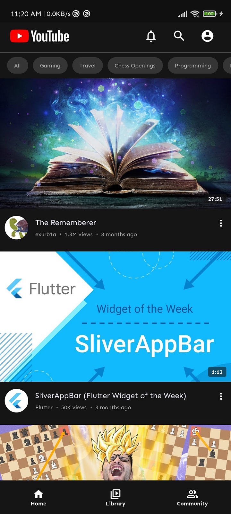
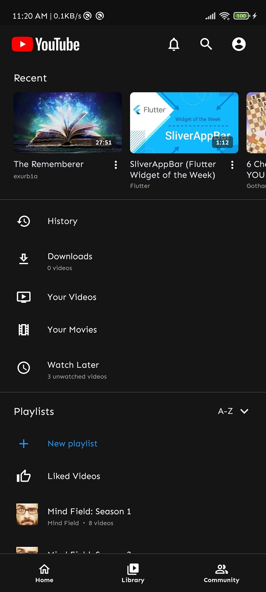
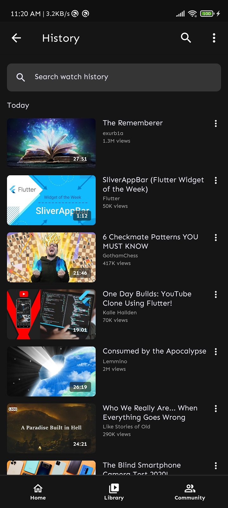
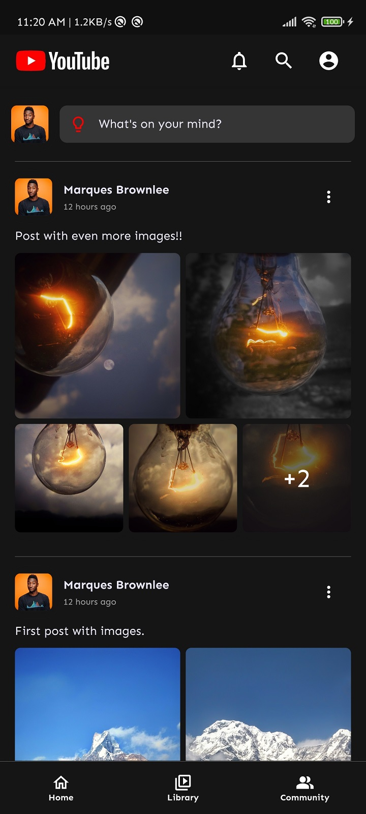
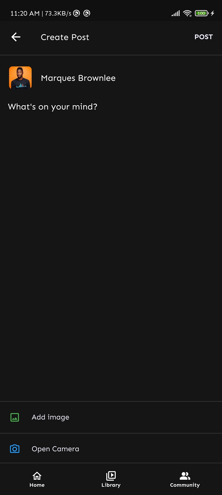

# YouTube Clone

A clone of the android YouTube app with added functionality for creating, editing and deleting posts in a facebook-like feed.

## Prerequisites

Ensure you have flutter installed on your system.

## Running the app

**Step 1:**

Clone this repo by using the link below:
```
https://github.com/AdarshaBista/YouTubeClone.git
```

**Step 2:**

Go to project root and execute the following command in terminal:
```
flutter pub get
```

**Step 3:**

This project uses firebase for CRUD functionality of posts. To setup firebase, please read [this medium article](https://medium.com/enappd/adding-firebase-to-your-flutter-app-281b8f391b47) by Shivam Goyal.

**Step 4:**

Run the app using:
```
flutter run
```

## Screenshots

    